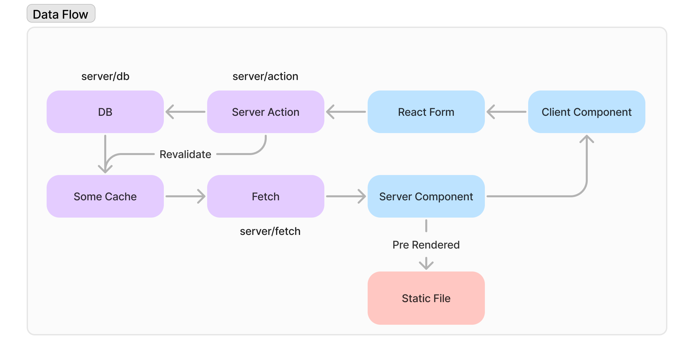

# Cotton's Blog

- Created using Next.js ~~14~~ 15 rc (Server Component)
- Prisma & WebAuthn manage comments

Some experimental things used here: Server Actions, Next.js Partial Prerendering.

A DataFlow Pic drawn with FigJam:

- [x] Home page design
- [x] Posts content render
- [x] Tags
- [x] Redesigned footer
- [x] Friends link page
- [x] About me page
- [x] Comments 🎉
- [ ] Dark Mode
- [ ] SiteMap
- [ ] i18n
- [ ] Support KaTeX
- [ ] Support link embedding

~~Abrove list may not be complete; I will manage the project [here](https://cottoncandyz.notion.site/Blog-Project-1c0160f383824ff9bd9315c470ecc309). May move to GitHub Projects recently.~~ [Moved](https://github.com/users/CottonCandyZ/projects/3).

## Thanks

- [DouLog](https://im.daidr.me/)
- [xiaojun Blog](https://github.com/xiaojundebug/xiaojun.im)
- [Josh W. Comeau](https://www.joshwcomeau.com/)
- [fuwari](https://github.com/saicaca/fuwari)
